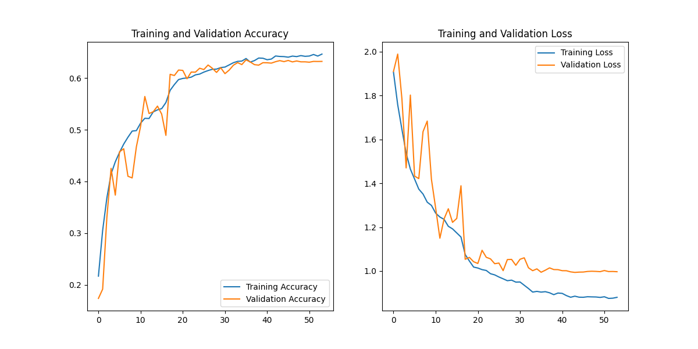

# 🧠 Focus Guard AI
**The Smart Desk Guardian that Protects your Flow State.**


*(Add your own screenshot here: screenshots/focus_guard_EXAMPLE.jpg)*

## 🚨 The Problem
Staying focused is hard. 
- You sit down to work/study.
- You get stressed or frustrated.
- Your productivity collapses, or you get distracted by your phone.
- Passive music playlists don't adapt to how you *actually* feel in the moment.

## 💡 The Solution: Focus Guard
**Focus Guard** is not just an AI project; it's a **proactive agent** that watches your emotional state and adjusts your environment to keep you in the zone.

It uses a **Computer Vision pipeline** to detect:
1.  **FOCUS (Neutral)**: Plays Deep Work / Hollywood Scores.
2.  **STRESS (Angry/Fear)**: Activates **"Rescue Protocol"** (Calming Bollywood/Lofi).
3.  **HAPPY**: Locks in the vibe with Upbeat Gujarati Romantic Hits.
4.  **DISTRACTION**: Pauses music if you are talking or distracted.

---

## 🚀 Key Features

### 1. 🛡️ Industrial Grade Robustness ("Mood Inertia")
Real humans don't hold a face for 5 minutes. We smile, we twitch, we drink water.
- **Problem**: Standard AI flickers between "Happy" and "Neutral" every second.
- **Solution**: **Mood Inertia**.
    - If you smile, the system **LOCKS** "Happy Mode" for **3 minutes**.
    - It ignores minor face changes (Neutral, Surprise) to keep the music flowing.
    - **Visual Feedback**: You see a `LOCKED (179s)` timer on the HUD.

### 2. 🚑 The Rescue Protocol
When **Stress levels** spike (e.g., coding error, difficult bug):
- The system detects it immediately.
- **Automatically switches** to calming, nostalgic tracks (e.g., Arijit Singh, Acoustic).
- **Asymmetric Release**: It stays in Rescue Mode until you have been **visibly calm (Neutral) for 12 seconds**.

### 3. 🎵 Hybrid Music Engine (Threaded)
- **Spotify Integration**: Controls your real Spotify account (Premium).
- **Smooth Fades**: Music fades out/in professionally during mood switches.
- **Non-Blocking**: Music logic runs on a background thread, so the video feed **never freezes**.

### 4. 🕵️ Smart "No Face" Logic
- If you leave the desk, the system defaults to **Focus/Neutral**.
- This ensures the "Stress Breaker" timer counts down continuously, even if you lean back or cover your face.

---

## 🛠️ Tech Stack
- **Core**: Python 3.11
- **AI/ML**: TensorFlow, Keras (Mini-Xception Model)
- **Computer Vision**: OpenCV (Haar Cascades, Real-time preprocessing)
- **Audio**: `spotipy` (Spotify Web API), `pygame` (Local Fallback)
- **Performance**: Threading for Audio, Mac Metal (MPS) Acceleration Support.

---

## � Model Performance
We trained a **Mini-Xception CNN** on the FER-2013 dataset.
- **Accuracy**: ~65% (Balanced)
- **Optimization**: Metal Performance Shaders (MPS) for Mac M1/M2/M3.



---

## 📸 Screenshots
The system provides real-time visual feedback:
The system provides real-time visual feedback:

| **Focus Mode** | **Stress Mode** |
|:---:|:---:|
|  |  |
| *Green Box: Neutral/Calm* | *Red Box: Stress/Anger* |

| **Happpy Mode** | **Locked (Inertia)** |
|:---:|:---:|
|  |  |
| *Magenta Box: Happiness* | *Timer: Mood Locked* |

| State | Description |
|---|---|
| **FOCUS** | Green Box. Playing: *Interstellar Soundtrack* |
| **STRESS** | Red Box. Playing: *Channa Mereya* |
| **LOCKED** | "LOCKED (160s)" text visible. Maintaining the vibe. |

---

## ⚡ Setup & Usage

### 1. Install Dependencies
```bash
pip install -r requirements.txt
```

### 2. Setup Spotify
- Create a Spotify Application in Developer Dashboard.
- Add your `client_id` and `client_secret` to environment variables or `spotify_client.py`.

### 3. Run the Guardian
```bash
./venv/bin/python -m src.main
```

### 4. Controls
- **'q'**: Quit.
- **'s'**: Save Screenshot (to `screenshots/` folder).

---

## 👨‍💻 Author
**Karnav** - *Building AI that understands Human context.*
